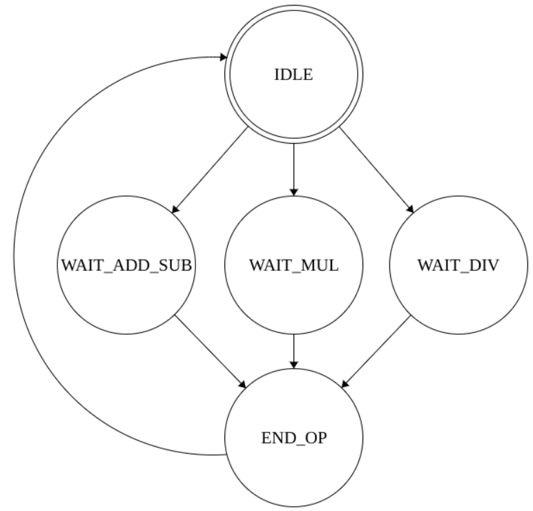
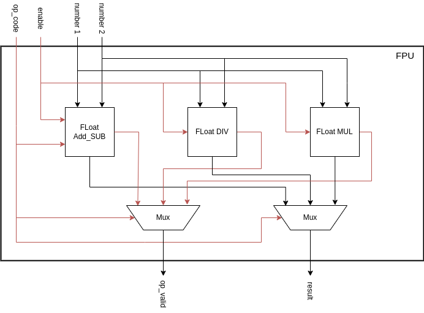

# FPU
Une unité de calcul en virgule flottante (en anglais Floating Point Unit, soit **FPU**) est un composant matériel d'un processeur qui permet d'effectuer des opérations arithmétiques sur des nombres à virgule flottante en respectant la norme IEEE 754. Dans ce projet, l'addition, la soustraction, la multiplication et la division sont implémentées en C++ et en VHDL afin de simuler le fonctionnement d'une FPU. La première étape du projet consiste à prototyper les algorithmes en C++ puis réaliser l'implémentation matérielle en VHDL.
## Implémantation C++
```C++
class FPU {

private:
    Binary_operations binary_operations;
    const int size_intermediate_mantissa = 24;
    float_ieee_754 f_out;
    int intermediate_mantissa_1;
    int intermediate_mantissa_2;
    int intermediate_mantissa_out;
    vector<bool> v_intermediate_mantissa_1;
    vector<bool> v_intermediate_mantissa_2;
    vector<bool> v_intermediate_mantissa_out;
    void align_mantissas(float_ieee_754 f1, float_ieee_754 f2);
    void normalize();
    
public:
    FPU();
    float_ieee_754 multiplication(float_ieee_754 f1, float_ieee_754 f2);
    float_ieee_754 division(float_ieee_754 f1, float_ieee_754 f2);
    float_ieee_754 addition(float_ieee_754 f1, float_ieee_754 f2);
    float_ieee_754 subtraction(float_ieee_754 f1, float_ieee_754 f2);
};
```
La classe C++ **FPU** représente une unité de calcul en virgule flottante.


Les membres privées de la classe **FPU** sont :
- **Binary_operations** : une classe qui effectue des opérations binaires.
- **size_intermediate_mantissa** : une constante qui détermine la taille de la mantisse intermédiaire.
- **f_out** : un type **float_ieee_754** qui stocke le résultat de l'opération.
- **intermediate_mantissa_1**, **intermediate_mantissa_2**, **intermediate_mantissa_out** : des variables entières qui stockent les mantisses intermédiaires des nombres d'entrée et du résultat.
- **v_intermediate_mantissa_1**, **v_intermediate_mantissa_2**, **v_intermediate_mantissa_out** : des vecteurs de booléens qui stockent les mantisses intermédiaires des nombres d'entrée et du résultat.
- **align_mantissas()** et **normalize()** : des fonctions membres privées qui sont utilisées pour aligner les mantisses des nombres d'entrée et normaliser le résultat.   

Les fonctions membres publiques de la classe **FPU** sont :
- Le constructeur **FPU()** : qui initialise les membres de la classe.
- **multiplication()** : qui effectue une multiplication en virgule flottante sur deux nombres d'entrée.
- **division()** : qui effectue une division en virgule flottante sur deux nombres d'entrée.
- **addition()** : qui effectue une addition en virgule flottante sur deux nombres d'entrée.
- **subtraction()** : qui effectue une soustraction en virgule flottante sur deux nombres d'entrée.

Chacune de ces fonctions prend deux arguments de type float_ieee_754, qui sont les nombres d'entrée, et renvoie un objet de type **float_ieee_754**, qui est le résultat de l'opération.
## Implémentation VHDL
```VHDL
entity fpu is
  port (
    reset_n  : in std_logic;
    clk      : in std_logic;
    enable   : in std_logic;
    op_valid : out std_logic;
    op_code  : in std_logic_vector(1 downto 0);
    number_1 : in std_logic_vector(31 downto 0);
    number_2 : in std_logic_vector(31 downto 0);
    result   : out std_logic_vector(31 downto 0)
  );
end entity;
```
L'entité **FPU** représente une unité de calcul en virgule flottante.   

Les entrées sont les suivantes :
- **number_1** et **number_2** : deux nombres flotants représentés sur 32 bits.
- **enable** : utilisé pour activer ou désactiver le fonctionnement de la FPU.  
- **op_code** : opération spécifique à effectuer :
  - **0b00** : l'addition
  - **0b01** : la soustraction
  - **0b10** : la multiplication
  - **0b11** : la division  

Les sorties sont les suivantes :
- **op_valid** : indique si une opération valide a été effectuée.   
- **result** : fournit le résultat de l'opération flotante sur 32 bits.  
### Machine d'état qui gère le fonctionnement de la FPU


### Synthèse RTL

